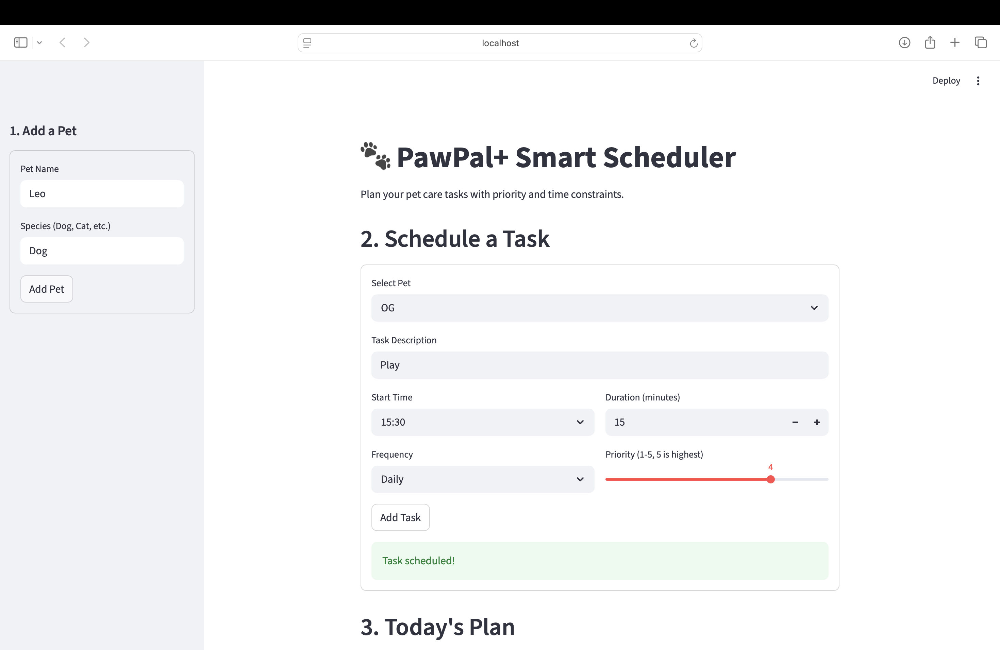
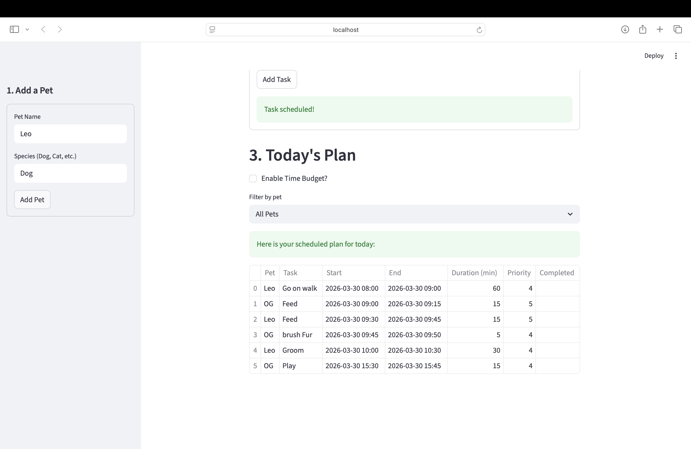
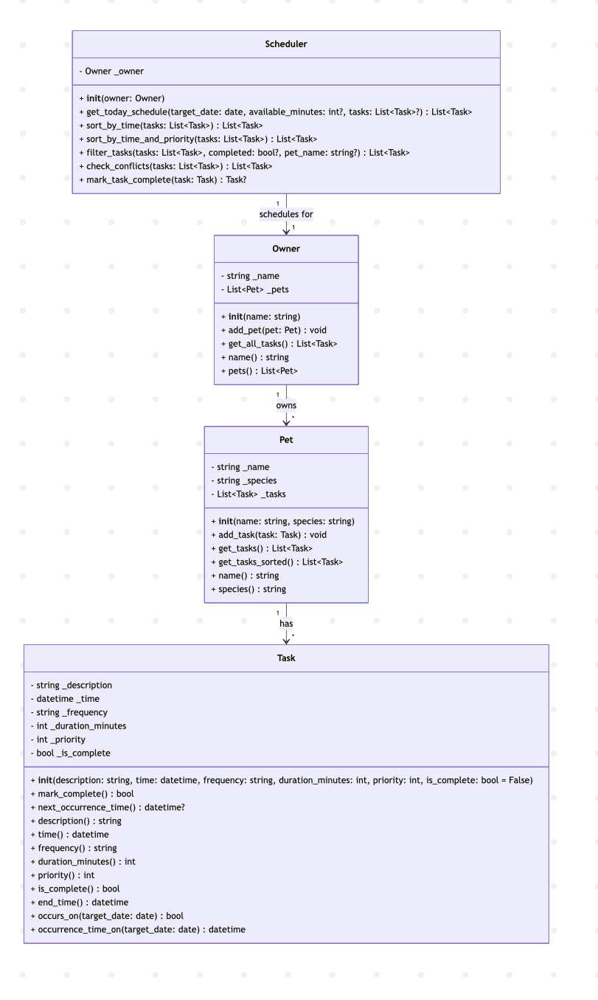

# PawPal+ (Module 2 Project)

You are building **PawPal+**, a Streamlit app that helps a pet owner plan care tasks for their pet.

## Scenario

A busy pet owner needs help staying consistent with pet care. They want an assistant that can:

- Track pet care tasks (walks, feeding, meds, enrichment, grooming, etc.)
- Consider constraints (time available, priority, owner preferences)
- Produce a daily plan and explain why it chose that plan

Your job is to design the system first (UML), then implement the logic in Python, then connect it to the Streamlit UI.

## What you will build

Your final app should:

- Let a user enter basic owner + pet info
- Let a user add/edit tasks (duration + priority at minimum)
- Generate a daily schedule/plan based on constraints and priorities
- Display the plan clearly (and ideally explain the reasoning)
- Include tests for the most important scheduling behaviors

## Getting started

### Setup

```bash
python -m venv .venv
source .venv/bin/activate  # Windows: .venv\Scripts\activate
pip install -r requirements.txt
```

### Suggested workflow

1. Read the scenario carefully and identify requirements and edge cases.
2. Draft a UML diagram (classes, attributes, methods, relationships).
3. Convert UML into Python class stubs (no logic yet).
4. Implement scheduling logic in small increments.
5. Add tests to verify key behaviors.
6. Connect your logic to the Streamlit UI in `app.py`.
7. Refine UML so it matches what you actually built.

## Smarter Scheduling

PawPal+ now includes smarter scheduling features to make daily planning more useful:

- **Time & Priority Sorting** – Tasks are ordered by start time, then by priority, so the most important tasks at each time slot appear first.
- **Pet Filtering** – View schedules for all pets together or filter down to a single pet in the UI.
- **Recurring Tasks** – Daily and weekly tasks automatically generate a new instance for the next occurrence when marked complete.
- **Conflict Detection** – Lightweight conflict checks warn when two tasks overlap in time (for the same or different pets), without stopping the app.
- **Task Filtering** – Tasks can be filtered by completion status or by pet name in the scheduler logic, enabling focused views and reports.

## Testing PawPal+

To run the automated test suite, use:

```bash
python -m pytest
```

The current tests cover:
* Core `Task` behavior (creation and completion).
* Adding tasks to a `Pet`.
* Scheduler sorting logic to ensure tasks are ordered chronologically and by priority.
* Recurring task handling for daily tasks (creating the next day’s task on completion).
* Conflict detection for overlapping tasks.

**Confidence Level:** ⭐⭐⭐☆☆ (3/5)

The suite validates key happy paths and several edge cases, but broader coverage (e.g., weekly recurrences, filtering combinations, and more complex schedules) would be needed for higher confidence.

##  Features

### Chronological & Priority-Aware Sorting
Tasks are consistently ordered by start time, then by importance. Under the hood, the scheduler uses `Scheduler.sort_by_time_and_priority` to sort tasks by:
* Scheduled datetime (`Task.time()`)
* Priority (higher priorities first)
* Duration (longer tasks first when time and priority are tied)

This sorting is applied both when building a daily schedule via `Scheduler.get_today_schedule` and again in the UI before display in `app.py`, ensuring that the most important work at each time slot appears at the top.

### Conflict Detection with Clear UI Warnings
The app performs lightweight conflict detection to warn when tasks overlap in time (for any pet). `Scheduler.check_conflicts` first orders tasks by start time and then flags any pair where a later task starts before an earlier one’s `Task.end_time`. In `app.py`, any conflicts are surfaced to the user with a warning banner and a table that lists:
* Pet name
* Task description
* Start and end times
* Priority

This keeps the schedule realistic without automatically changing the user’s planned times.

### Automatic Handling of Recurring Tasks
Daily and weekly tasks automatically generate the next occurrence when completed. When a task is marked done via `Scheduler.mark_task_complete`, the system:
* Marks the original `Task` as complete using `Task.mark_complete()`
* Uses `Task.next_occurrence_time` to compute the next datetime (next day for “Daily”, next week for “Weekly”)
* Creates a new `Task` instance with the same description, frequency, duration, and priority
* Attaches the new task to the same `Pet` that owned the original

This supports continuous routines like daily walks or medications without manual re-entry.

### Daily Time Budget & Greedy Filtering
Users can specify how many minutes they have available today, and the scheduler will pick a subset of tasks that fits within that budget. `Scheduler.get_today_schedule` first filters tasks that occur on the selected date (respecting *Once*, *Daily*, and *Weekly* rules via `Task.occurs_on()` and `Task.occurrence_time_on()`), then sorts them by time and priority. 

If a time budget is provided from the UI in `app.py`, it iterates in order and greedily includes each task whose `Task.duration_minutes()` fits in the remaining minutes, stopping once the budget is exhausted. This produces a realistic, chronological plan that respects the user’s limited time while favoring earlier and higher-priority tasks.

### Scheduling & Algorithms Demo

- **Sorted Daily Schedule**  
  When you add tasks for one or more pets, PawPal+ builds a day plan that is:
  - Ordered by start time,
  - Then by priority (higher priority first),
  - Then by duration (longer tasks first when there’s still a tie).

- **Conflict Warnings for Overlapping Tasks**  
  If two tasks overlap in time (even across different pets), the scheduler flags them.  
  In the Streamlit UI this appears as:
  - A warning banner explaining that some tasks conflict.
  - A table showing each conflicting task with its pet, description, start/end time, and priority.

- **Daily Recurring Tasks in Action**  
  Mark a daily (or weekly) task as complete and the system:
  - Marks today’s task as done.
  - Automatically creates the next occurrence at the same time on the next day (or next week) for the same pet.

- **Time Budget Filtering**  
  Enable the “time budget” option and enter how many minutes you have today.  
  The demo shows how PawPal+:
  - Filters tasks that occur today,
  - Sorts them by time and priority,
  - Then greedily selects tasks until your available minutes are used up, giving you a realistic, time‑bounded plan.

##  Demo
### Streamlit App Interface




### System Architecture
